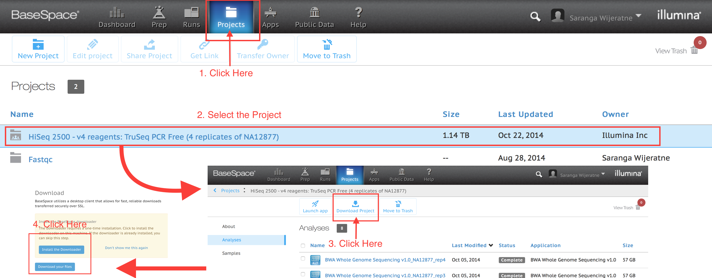
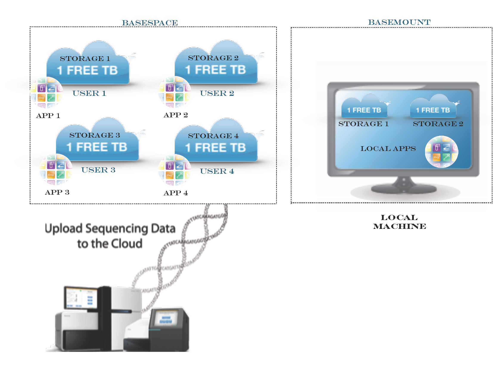
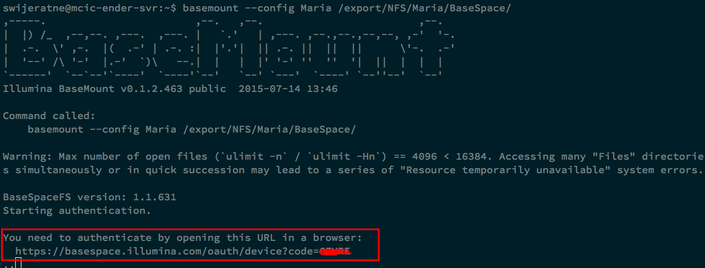
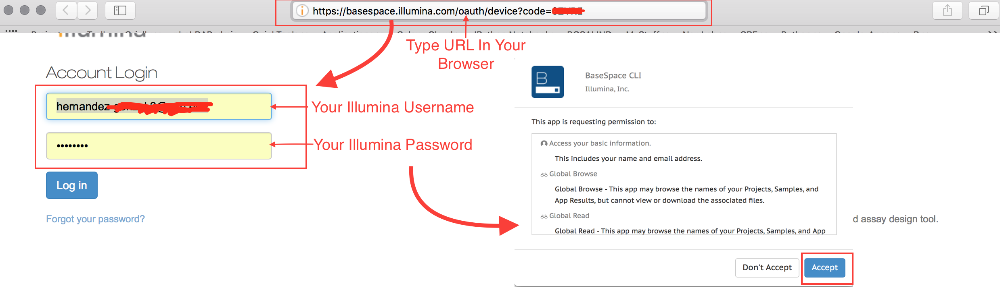
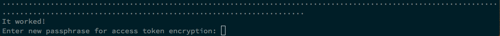
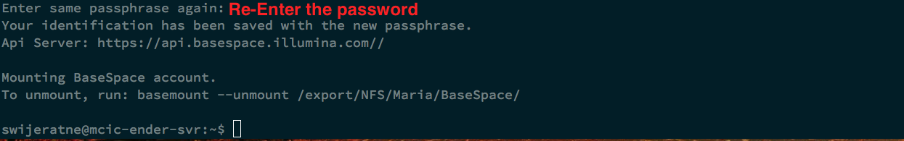

.. MCBL documentation master file, created by
   sphinx-quickstart on Wed Sep 23 17:00:18 2015.
   You can adapt this file completely to your liking, but it should at least
   contain the root `toctree` directive.

.. module:: Introduction
   :synopsis: Introduction to BaseMount
.. moduleauthor:: Saranga Wijeratne<wijeratne.3@osu.edu>

.. highlight:: rest

**********************************************
1. Introduction
**********************************************

1.1. File Access (Traditional Way)
--------------

1.2. File Access (with BaseMount)
--------------

1.4. What is BaseMount?
---------------------

**BaseMount** is a machanisum that enables access to your **basespace storage** as a **Linux file system**.

1.5. Advantages of the BaseMount?
---------------------

- Have access to your Projects, Runs, and App results as your local files.
- Can run **local apps** on basespace data **without downloading data to your local computer.**
- Can save your local storage space.:

   "Although BaseMount does facilitate file download, we would recommend that since BaseMount allows convenient, fast, cached access to your BaseSpace metadata and files, you may find that many operations can be carried out without the need to download locally. Duringour testing, we have used BaseMount to grep through fastq files, extract blocks of reads from bam files and even use IGV on the bam files directly all without downloading files locally. This can be more convenient than including a download step and saves on the overheads of local storage." -Illumina

1.6. Official page
----------------
.. raw:: html

    

      <iframe width="900" height="600" src="https://basemount.basespace.illumina.com" frameborder="0" allowfullscreen></iframe>
    

**********************************************
2. BaseMount Installation
**********************************************

2.1. Quick Install
----------------
.. highlight:: bash
   :linenothreshold: 5

.. code-block:: bash
   
   sudo bash -c "$(curl -L https://basemount.basespace.illumina.com/install/)"

2.2. Manual install
----------------

**Supported Operating Systems:** Ubuntu, Centos

-----

Ubuntu 14 & 15

.. highlight:: bash
   :linenothreshold: 3

.. parsed-literal::
   
   wget https://bintray.com/artifact/download/basespace/BaseSpaceFS-DEB/bsfs_1.1.631-1_amd64.deb
   wget https://bintray.com/artifact/download/basespace/BaseMount-DEB/basemount_0.1.2.463-20150714_amd64.deb
   sudo dpkg -i --force-confmiss bsfs_1.1.631-1_amd64.deb
   sudo dpkg -i basemount_0.1.2.463-20150714_amd64.deb

2.3. Mounting Your BaseSpace Account
----------------

.. parsed-literal::
   
   basemount --config {config_file_prefix} {mount-point folder}

   basemount --config user1 ~/BaseSpace_Mount

**Example:**

------

.. parsed-literal::

   mkdir /export/NFS/Saranga/BaseSpace
   mkdir /export/NFS/Maria/BaseSpace

   basemount --config Maria /export/NFS/Maria/BaseSpace/

Then open your internet browser,

After you click "Accept",

To access the folder, type,

.. parsed-literal::

   cd /export/NFS/Maria/BaseSpace/
   ls
   Projects  Runs

.. toctree::
   :maxdepth: 3

   

